# ER-диаграмма базы данных карьерного центра

Документ подготовлен по основным Django-моделям проекта и ориентирован на использование в разделе диплома «Разработка базы данных веб-приложения».

## Основные таблицы

| Таблица | Django-модель | Назначение | Первичный ключ | Внешние ключи |
| --- | --- | --- | --- | --- |
| `accounts_user` | `User` | Пользователи системы: студенты, кураторы, администраторы. | `id` | `curator_id -> accounts_user.id`, `study_group_id -> accounts_studygroup.id` |
| `accounts_specialty` | `Specialty` | Справочник специальностей. | `id` | — |
| `accounts_studygroup` | `StudyGroup` | Учебные группы. | `id` | `specialty_ref_id -> accounts_specialty.id`, `curator_id -> accounts_user.id` |
| `accounts_studentprofile` | `StudentProfile` | Расширенный профиль студента. | `id` | `user_id -> accounts_user.id` (`OneToOne`) |
| `portfolio_portfolioentry` | `PortfolioEntry` | Записи портфолио студента. | `id` | `student_id -> accounts_user.id`, `reviewed_by_id -> accounts_user.id` |
| `portfolio_portfolioattachment` | `PortfolioAttachment` | Дополнительные файлы к записи портфолио. | `id` | `entry_id -> portfolio_portfolioentry.id` |
| `resumes_resumesettings` | `ResumeSettings` | Настройки публичного резюме студента. | `id` | `student_id -> accounts_user.id` (`OneToOne`) |
| `vacancies_vacancy` | `Vacancy` | Вакансии работодателей. | `id` | — |
| `vacancies_vacancyresponse` | `VacancyResponse` | Отклики студентов на вакансии. | `id` | `student_id -> accounts_user.id`, `vacancy_id -> vacancies_vacancy.id` |
| `vacancies_studentfavoritevacancy` | `StudentFavoriteVacancy` | Избранные вакансии студентов. | `id` | `student_id -> accounts_user.id`, `vacancy_id -> vacancies_vacancy.id` |
| `courses_course` | `Course` | Курсы, семинары и практики. | `id` | — |
| `courses_courseregistration` | `CourseRegistration` | Записи студентов на курсы. | `id` | `student_id -> accounts_user.id`, `course_id -> courses_course.id` |
| `courses_studentfavoritecourse` | `StudentFavoriteCourse` | Избранные курсы студентов. | `id` | `student_id -> accounts_user.id`, `course_id -> courses_course.id` |
| `accounts_supportticket` | `SupportTicket` | Обращения в поддержку из личного кабинета и публичной формы. | `id` | `student_id -> accounts_user.id`, `requester_id -> accounts_user.id` |
| `accounts_activitylog` | `ActivityLog` | Лента событий студента. | `id` | `student_id -> accounts_user.id` |
| `accounts_adminactivitylog` | `AdminActivityLog` | Журнал действий администратора. | `id` | `actor_id -> accounts_user.id` |

## Mermaid ERD

```mermaid
erDiagram
    USER {
        bigint id PK
        string email UK
        string full_name
        string role
        string academic_status
        bigint curator_id FK
        bigint study_group_id FK
    }

    SPECIALTY {
        bigint id PK
        string code
        string name
        string letter_code
        boolean is_active
    }

    STUDY_GROUP {
        bigint id PK
        string name UK
        string specialty
        bigint specialty_ref_id FK
        int admission_year
        smallint course_number
        smallint subgroup_number
        bigint curator_id FK
        boolean is_active
    }

    STUDENT_PROFILE {
        bigint id PK
        bigint user_id FK
        string phone
        string city
        string contact_link
        string public_resume_token UK
        datetime created_at
        datetime updated_at
    }

    PORTFOLIO_ENTRY {
        bigint id PK
        bigint student_id FK
        string type
        string title
        date date
        string status
        bigint reviewed_by_id FK
        datetime reviewed_at
        datetime created_at
        datetime updated_at
    }

    PORTFOLIO_ATTACHMENT {
        bigint id PK
        bigint entry_id FK
        string file
        datetime uploaded_at
    }

    RESUME_SETTINGS {
        bigint id PK
        bigint student_id FK
        string title
        string template
        string font_size
        boolean is_public
        string photo_source
    }

    VACANCY {
        bigint id PK
        string title
        string company
        string contacts
        string employment_type
        string format_type
        string direction
        string status
        datetime created_at
        datetime updated_at
    }

    VACANCY_RESPONSE {
        bigint id PK
        bigint student_id FK
        bigint vacancy_id FK
        datetime created_at
        string resume_link_snapshot
    }

    STUDENT_FAVORITE_VACANCY {
        bigint id PK
        bigint student_id FK
        bigint vacancy_id FK
        datetime created_at
    }

    COURSE {
        bigint id PK
        string title
        string kind
        string format_type
        string organization
        string contacts
        date date
        int places
        string status
        datetime created_at
        datetime updated_at
    }

    COURSE_REGISTRATION {
        bigint id PK
        bigint student_id FK
        bigint course_id FK
        string status
        datetime created_at
    }

    STUDENT_FAVORITE_COURSE {
        bigint id PK
        bigint student_id FK
        bigint course_id FK
        datetime created_at
    }

    SUPPORT_TICKET {
        bigint id PK
        bigint student_id FK
        bigint requester_id FK
        string category
        string requester_type
        string source
        string public_email
        string subject
        string status
        datetime created_at
        datetime updated_at
        datetime resolved_at
    }

    ACTIVITY_LOG {
        bigint id PK
        bigint student_id FK
        string event_type
        string title
        datetime created_at
        string related_model
        int related_object_id
    }

    ADMIN_ACTIVITY_LOG {
        bigint id PK
        bigint actor_id FK
        string action
        string object_type
        int object_id
        string object_repr
        datetime created_at
    }

    SPECIALTY ||--o{ STUDY_GROUP : "has groups"
    USER ||--o{ STUDY_GROUP : "curates"
    STUDY_GROUP ||--o{ USER : "contains students"
    USER ||--o{ USER : "curates students"

    USER ||--o| STUDENT_PROFILE : "has profile"
    USER ||--o| RESUME_SETTINGS : "has resume settings"

    USER ||--o{ PORTFOLIO_ENTRY : "creates"
    USER ||--o{ PORTFOLIO_ENTRY : "reviews"
    PORTFOLIO_ENTRY ||--o{ PORTFOLIO_ATTACHMENT : "has files"

    USER ||--o{ VACANCY_RESPONSE : "sends"
    VACANCY ||--o{ VACANCY_RESPONSE : "receives"
    USER ||--o{ STUDENT_FAVORITE_VACANCY : "adds"
    VACANCY ||--o{ STUDENT_FAVORITE_VACANCY : "is favorite"

    USER ||--o{ COURSE_REGISTRATION : "registers"
    COURSE ||--o{ COURSE_REGISTRATION : "has registrations"
    USER ||--o{ STUDENT_FAVORITE_COURSE : "adds"
    COURSE ||--o{ STUDENT_FAVORITE_COURSE : "is favorite"

    USER ||--o{ SUPPORT_TICKET : "student tickets"
    USER ||--o{ SUPPORT_TICKET : "requester tickets"
    USER ||--o{ ACTIVITY_LOG : "has activity"
    USER ||--o{ ADMIN_ACTIVITY_LOG : "performs admin actions"
```

## Краткое описание связей для раздела «Разработка базы данных веб-приложения»

База данных веб-приложения построена вокруг сущности `User`, которая хранит учетные записи студентов, кураторов и администраторов. Для студентов предусмотрена нормализованная академическая структура: пользователь может быть привязан к одной учебной группе (`StudyGroup`), а учебная группа — к одной специальности (`Specialty`). Одна специальность объединяет несколько учебных групп, а одна учебная группа объединяет несколько пользователей-студентов. Дополнительно пользователь может ссылаться на другого пользователя в роли куратора, что позволяет хранить связь «куратор — студенты».

Персональные данные студента расширяются через таблицу `StudentProfile`, связанную с `User` отношением один-к-одному. Настройки публичного резюме вынесены в отдельную таблицу `ResumeSettings`, которая также имеет связь один-к-одному с пользователем. Такое разделение позволяет хранить учетные данные, профиль и параметры резюме независимо друг от друга.

Портфолио реализовано как связь один-ко-многим между `User` и `PortfolioEntry`: один студент может создать много записей портфолио. Каждая запись может быть проверена куратором или администратором через внешний ключ `reviewed_by_id` на `User`. Дополнительные документы и изображения вынесены в таблицу `PortfolioAttachment`, связанную с `PortfolioEntry` отношением один-ко-многим.

Модуль вакансий содержит справочник вакансий `Vacancy`. Отклики студентов хранятся в связующей таблице `VacancyResponse`, которая связывает пользователя и вакансию отношением многие-ко-многим с дополнительными атрибутами, например датой отклика и сохраненной ссылкой на резюме. Избранные вакансии реализованы аналогичной связующей таблицей `StudentFavoriteVacancy`; уникальное ограничение не допускает повторного добавления одной и той же вакансии одним студентом.

Модуль курсов построен по похожему принципу. Таблица `Course` хранит сведения о курсах, семинарах и практиках. Запись студента на курс фиксируется в таблице `CourseRegistration`, которая связывает `User` и `Course`, хранит статус регистрации и дату создания записи. Избранные курсы сохраняются в таблице `StudentFavoriteCourse`, где пара «студент — курс» является уникальной.

Обращения в поддержку хранятся в таблице `SupportTicket`. Обращение может быть связано со студентом через `student_id`, а также с пользователем, который создал обращение, через `requester_id`. Такая модель поддерживает как обращения из личного кабинета, так и публичные обращения без авторизации, для которых контактные данные сохраняются в текстовых полях.

Журнал событий студента представлен таблицей `ActivityLog`, связанной с `User` отношением один-ко-многим. Он фиксирует действия студента в системе: добавление портфолио, запись на курс, отклик на вакансию и другие события. Административный аудит хранится отдельно в `AdminActivityLog`: запись связывается с пользователем-администратором через `actor_id`, а объект действия описывается полями `object_type`, `object_id` и `object_repr`. Поля `related_model`/`related_object_id` в `ActivityLog` и `object_type`/`object_id` в `AdminActivityLog` являются полиморфными ссылками и не оформлены как физические внешние ключи.
